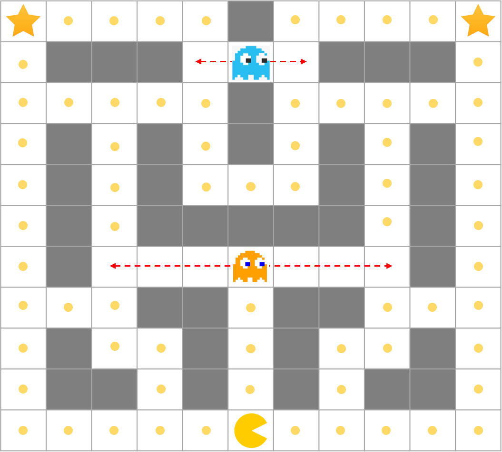

# Pac-man Bot

Solving the Pac-man game with reinforcement learning.




## Contents

1. Value Iteration
2. Policy Iteration
3. Monte-Carlo Method
4. SARSA
5. Q Learning
6. Actor-Critic Method
7. REINFORCE

## Overview

> TBA

TBA

### MDP

- State space:
- Action space:
- Reward: 

*MDP image*

## How To Run

```sh
# TBA
```

## References

- Sutton, Richard S., and Andrew G. Barto. *Reinforcement learning: An introduction*. MIT press, 2018.
- [UNIST AI51201 Reinforcement Learning](https://sites.google.com/view/rl-unist-2021-fall/home), Instructor [Sungbin Lim](https://www.google.com/url?q=https%3A%2F%2Fsites.google.com%2Fview%2Fsungbin%2F&sa=D&sntz=1&usg=AFQjCNF8rjDRU3_7d8WL6v4kWLEzeyCZbw)

