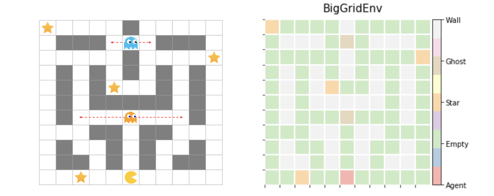

# Pac-man Bot

This repository contains the implementation of a simple reinforcement learning task. So it's not exactly the same as the original Pac-man game. In this environment, the episode ends when the agent gets all the stars (unlike the original Pac-man game that the episode ends when all coins are removed).


*<Taken from: https://pixabay.com/images/id-1332694/>*

## Algorithms

The algorithms in this repository focus on table-based classical reinforcement learning algorithms that do not use the deep neural network.

1. Monte-Carlo Method
2. SARSA
2. Q-learning
2. Double Q-learning
2. Value Approximation
2. Actor-Critic
2. REINFORCE

## How To Run

You can execute code in `scripts` directory. The name of the script file means *`algorithm-environment.sh`*.

```sh
cd scripts/
sh ${runfile name} 	# Ex) sh mc-small.sh
```

The results of code execution can be found in the `results` directory or terminal window.


### Requirements

```python
# TBA
```

## Environments

### SmallGridEnv

In this environment, the ghost *does not move*. And since there is only one star, the episode ends when the agent arrives at the star. The figure below is a visualization of the environment through `visualize_matrix()`. Visualization is also possible through the `env.render()` function.

- Observation space: 5 x 5 grid world - wall positon 
  - `observation_space.n`  = (25 - 5) = 20
- Action space: { up: 0, down: 1, left: 2, right: 3 }
- Reward: { ghost: -100, wall: -5, others: -1 }
  - Encountering a wall does not end the episode. The agent is just stationary as it is.


### BigGridEnv

In this environment, the ghost *randomly moves left and right*. And since there are multiple stars, the episode ends when all the stars are obtained. The visualization method is the same as SmallGridEnv.

- Observation space: (11 x 11 grid world - wall positon) x (Star state) x (Ghost position state)
  - `observation_space.n` = (121 - 40) * (2^4) * (3 * 7) = 27216
- Action space: { up: 0, down: 1, left: 2, right: 3 }
- Reward: { star: 100, ghost: -100, wall:-5 ,others: -1 }
  - Encountering a wall does not end the episode. The agent is just stationary as it is.




### UnistEnv

There is no big difference from BigGridEnv. It's just that the wall position and the ghost position have changed. And the wall looks like UNIST :kissing_smiling_eyes:


## References

- Sutton, Richard S., and Andrew G. Barto. *Reinforcement learning: An introduction*. MIT press, 2018.
- [UNIST AI51201 Reinforcement Learning](https://sites.google.com/view/rl-unist-2021-fall/home), Instructor [Sungbin Lim](https://www.google.com/url?q=https%3A%2F%2Fsites.google.com%2Fview%2Fsungbin%2F&sa=D&sntz=1&usg=AFQjCNF8rjDRU3_7d8WL6v4kWLEzeyCZbw)

